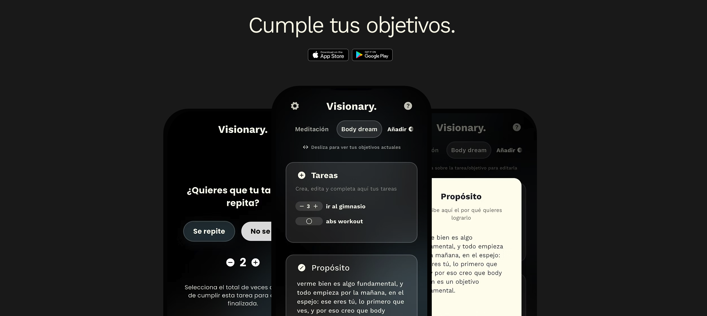
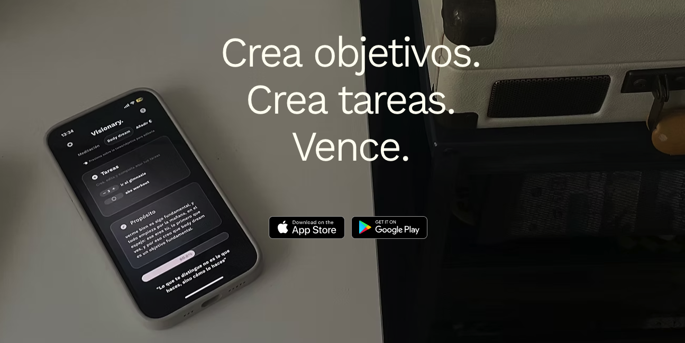

# Visionary 
A goal-tracking app to help users set clear objectives, stay consistent, and measure progress over time.
Built with Flutter and Firebase, focused on clean architecture, scalability, and a smooth mobile experience.
> [!NOTE]
> This app is a personal project and is **not intended for public release** or distribution.

---

## Why Visionary 
Most goal apps are either too simple (just checklists) or too complex (too many features, no clarity).
Visionary focuses on a clean flow: define a goal → break it into actionable steps → track progress → reflect and iterate.

---

## Key Features 
- Goal creation with description, priority and target dates
- Milestones / tasks to break goals into smaller steps
- Progress tracking (completion %, history, and basic insights)
- Firebase Authentication (secure sign-in)
- Cloud data sync (same account across devices)

> Update this section to match exactly what your current build includes.

---

## Tech Stack 
- **Flutter (Dart)** — cross-platform mobile development
- **Firebase**
  - Authentication
  - Firestore or Realtime Database (depending on the project setup)
  - Analytics (optional)
- **Architecture**: feature-based structure + separation of concerns

---

## Architecture & Design 
Visionary is structured to be maintainable and team-friendly:
- **Feature-based folders** (each feature owns its UI, logic, and data layer)
- **Separation of concerns** between presentation, domain, and data
- **Reusable UI components** to keep the design consistent
- **Testability** in mind (domain logic isolated from UI)

---

## Roadmap 
- [ ] Reminders and habit loops (notifications)
- [ ] Better analytics dashboard (personal insights)
- [ ] Offline-first improvements

---

## Contributing 🤝
Contributions are welcome:
1) Fork the repo
2) Create a branch: git checkout -b feature/my-feature
3) Commit: git commit -m "Add my feature"
4) Push: git push origin feature/my-feature
5) Open a Pull Request

